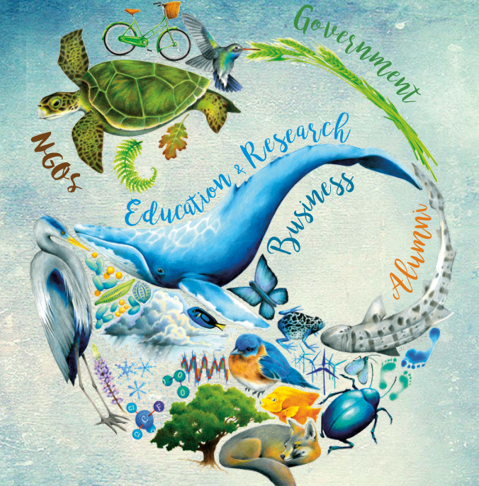

```{r setup, include=FALSE}
knitr::opts_chunk$set(echo = FALSE)
```

In September of 2020, I began my journey as a graduate student at the Bren School of Environmental Science & Management at the University if California, Santa Barbara. My goals were to work hard, learn new skills and keep an open mind to any and all possibilities. With these goals in my mind, I can confidently say I've been doing well at achieving what I came to graduate school to do. As my cohort moves into a crucial decision-making time, I've had excellent experiences since my start that have allowed to me to more clearly see my future in environmental science. 

Since starting in the fall, I have developed crucial skills in science communication, statistical computing and spatial mapping. I have also built on my leadership skills and environmental science understanding. I have decided to pursue a focus in Conservation Planning and a sub-focus in Strategic  Environmental Communications to help me work towards my career goals and aspirations. With this background and a successful summer internship on the horizon I truly believe I will be ready to enter the workforce and improve our environment. I want to be an effective science communicator that utilizes data analysis and visualizations to captivate and inspire people from all walks of life especially those from marginalized communities. 

I'm looking forward to building on these skills and learning so much more through additional coursework and my group project. I will have more information on my group project once they are officially assigned in late March 2021. I know that whatever my project is, I will be able to learn new skills, meet new people and solve a real environmental issue and I can't wait to get started!



