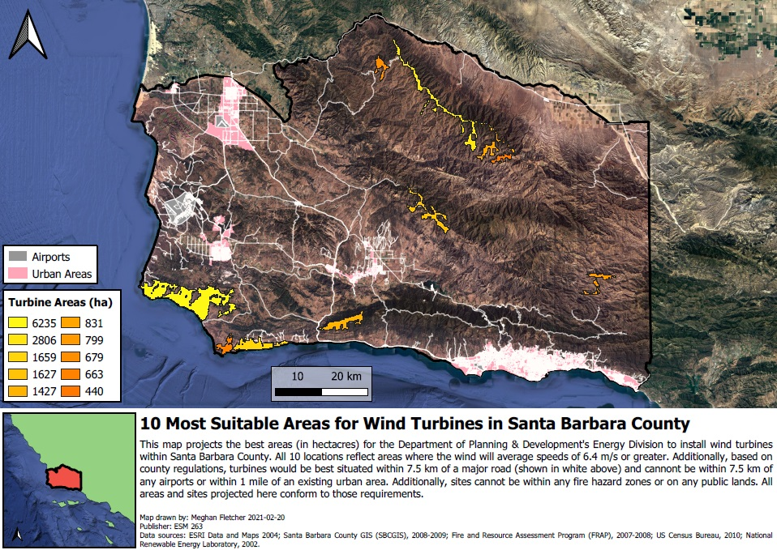

During Winter Quarter 2021, I took ESM 263 - Geographic Information Systems (GIS) to improve on my knowledge of spatial analysis. One of our assignments involved utilizing the graphical modeler in QGIS to build the framework for a final map. Using this analysis, the goal was to find the 10 most suitable areas in Santa Barbara County to place wind turbines. The suitability of these sites was based on the following criteria:

**Wind:** Sites must have sufficient wind power density.

**Roads:** Sites must be within 7.5 km of a major road.

**Airports:** Sites cannot be within 7.5 km of an airport.

**Urban:** Sites cannot be within 1 mile of an existing urban area.

**Fire:** Sites cannot be within fire hazard zones.

**Public:** Sites cannot be on public land.
  

Further details regarding the analysis performed within the graphical modeler can be found at: https://ucsb-bren.github.io/ESM263-2021/assignments/03/

