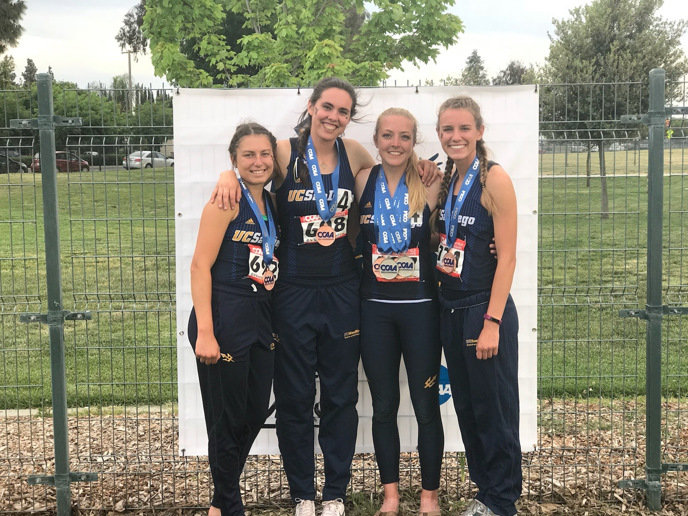
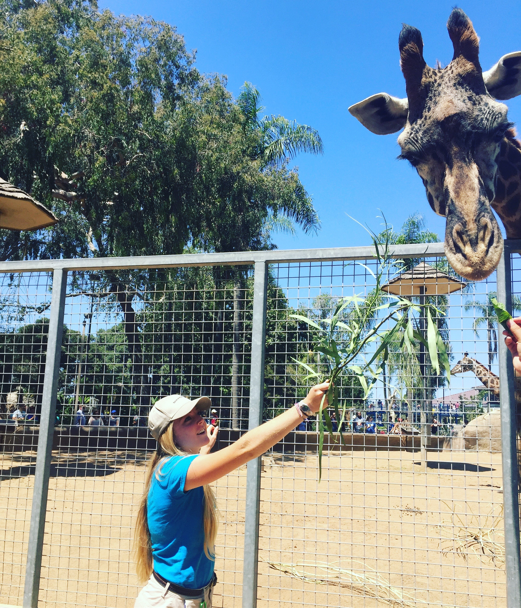
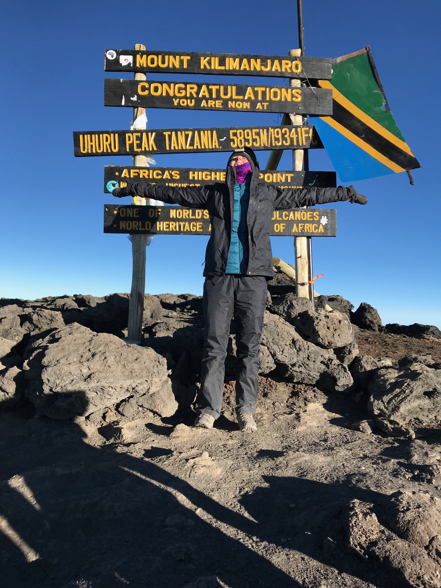

```{r setup, include=FALSE}
knitr::opts_chunk$set(echo = FALSE)

library(tidyverse)
library(here)
```


Meghan Fletcher was born and raised in Pleasanton, California. She has always been passionate about animals and conservation and has continued to follow her passion and is now getting her masters degree from the Bren School of Environmental Science & Management and will be focusing on Conservation planning and Strategic Environmental Communication. 


Before Bren, Meghan earned her bachelors degree from UC San Diego. There, she majored in Ecology, Behavior and Evolution and minored in Marine Science. She was also an NCAA track & field scholar-athlete for the Tritons. She ran the 100 and 400 meter hurdles as well as the 4x100 and 4x400 meters relays. Meghan was nominated as a captain her junior year and was lead captain her senior year. She holds three All-Conference title and was a national qualifier in the 400 meter hurdles in 2018 and competed in the 2018 Division II National Track & Field Championships. 



During the summer of 2017 and 2018, Meghan worked at the San Diego Zoo in the education department. There she found her passion for science communication and how powerful empathy and connection could be at helping young kids care for the plant and its inhabitants. Meghan co-taught specific curriculum to first-grade students and helped them on their journey to become "heroes for wildlife". Meghan knew she wanted to do more work like this, but wasn't sure where to take her career next.



After finishing her last summer at the zoo, Meghan spent some time in a could different roles as she figured out what's next. She worked as the director of operations for the UC San Diego Track & Field Team and was also a marketing intern for the Athletics Departments. The year, Meghan decided to take a trip with her best friend that would ultimately lead her to the Bren School

In the summer of 2019, Meghan traveled to Tanzania. While there she climbed Kilimanjaro and went on safari with her best friend. While there, Meghan was inspired by the people she met and the places she saw and knew she needed to figure out how she could make an impact in communities that needed help the most. With environmental injustice more prevalent, Meghan decided she could do more but she would need more experience first. Upon finding Bren, she knew she had found something special.

Now, Meghan is planning on using her degree to ultimately lead her to a career in science communication. However, she has seen the true value in data analysis, spatial mapping and various other analytical tools and is excited to pursue further learning in those areas in addition to focusing on Strategic Environmental Communication so that she can become a successful science communicator who can create and facilitate new ways to engage people from all walks of life, especially those from marginalized communities. 




